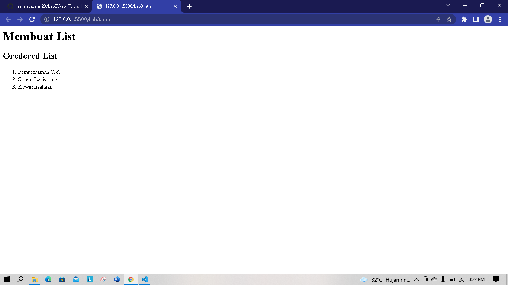
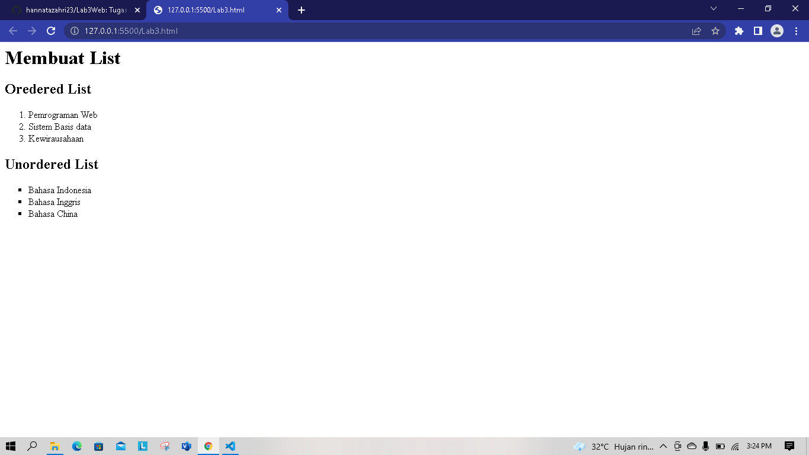
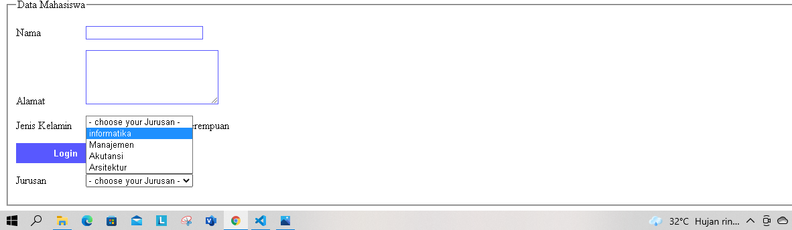

# MEMBUAT ORDERED LIST


ordered list di gunakan untuk membuat daftar dimana tiap bagiannya di tandai dengan sebuah simbol

## source code
```html
header>
    <h1>Membuat List</h1>
</header>
<section id="order-list">
    <h2>Oredered List</h2>
    <ol>
        <li>Pemrograman Web</li>
        <li>Sistem Basis Data</li>
        <li>Kewirausahaan</li>
    </ol>
</section>
```

# MEMBUAT UNODERED LIST


unordered list digunakan untuk membuat daftar di mana tiap bagiannya memiliki nomer terurut.
```html
<section id="unorder-list">
    <h2>Unordered List</h2>
        <ul type="square">
            <li>Bahasa Indonesia</li>
            <li>Bahasa Inggris</li>
            <li>Bahasa China</li>
        </ul>
</section>
```

# MEMBUAT DESCRIPTION LIST
.png)

Description list digunakan untuk membuat daftar dimana tiap daftar tersebut memiliki penjelasan "sub-bagian"
ada tiga tag yang digunakan untuk membuat description list
## source code
```html
<section id="unorder-list">
    <h2>Description List</h2>
    <dl>
        <dt>Fakultas Teknik</dt>
        <dd>Teknik Lingkungan</dd>
        <dd>Teknik Informatika</dd>
        <dd>Teknik Industri</dd>
        <dt>Fakultas Ekonomi dan Bisnis</dt>
        <dd>Bisnis digital</dd>
        <dd>Akutansi</dd>
        <dd>Manajemen</dd>
    </dl>
</section>
```

# MEMBUAT TABLE
.png)

Table digunakan untuk menyajikan data dalam bentuk kolom dan baris, tujuan agar informasi dapat di tampilkan secara lebih terstruktur dan tabular.
## Source code
```html
<header>
    <h1>Membuat Tabel</h1>
</header>
<table border="2" cellpadding="5" cellspacing="1">
    <thead>
        <tr>
            <th>Nama</th>
            <th>Kelas</th>
            <th>Kursus Bahasa</th>
        </tr>
    </thead>
    <tbody>
        <tr>
            <td>Mahendra wijaya</td>
            <td>TI.20.A2</td>
            <td>Bahasa Indonesia</td>
        </tr>
        <tr>
            <td>Nia dwi rahayu</td>
            <td>TI.20.A1</td>
            <td>Bahasa Inggris</td>
        </tr>
        <tr>
            <td>Herliansyah</td>
            <td>TI.20.A2</td>
            <td>Bahasa China</td>
        </tr>
    </tbody>
</table>
```

# MENGATUR MARGIN DAN PADDING
.png)

## Source code
```html
<table border="1" cellpadding="4" cellspacing="0">
```

# MENGGABUNGKAN SEL DATA
.png)

sel data dapat di gabungkan untuk keperluan tertentu, untuk menggabungan sel secara vertikal menggunakan atribut "rowspan" dan untuk menggabungkan sel secara horizontal menggunakan atribut "colspan"
## Source code
```html
<table border="1" cellpadding="4" cellspacing="0">
    <thead>
        <tr>
            <th>Nama</th>
            <th>Kelas</th>
            <th>Kursus Bahasa</th>
        </tr>
    </thead>
    <tbody>
        <tr>
            <td>Mahendra wijaya</td>
            <td rowspan="3">TI.20.A1 & A2</td>
            <td>Bahasa Indonesia</td>
        </tr>
        <tr>
            <td>Nia dwi rahayu</td>
            <td>Bahasa Inggris</td>
        </tr>
        <tr>
            <td>Herliansyah</td>
            <td>Bahasa China</td>
        </tr>
    </tbody>
</table>
```

# MEMBUAT FORMULIR
.png)

Formulir dapat di isi kemudian di proses dengan program tertentu, baik dari server ataupun dari sisi client
## source code

```html
<form action="proses.php" method="post">
    <fieldset>
        <legend>Data Player</legend>
        <p>
            <label for="nama">Nama</label>
            <input type="text" id="nama" name="nama">
        </p>
        <p>
            <label for="alamat">Alamat</label>
            <textarea name="alamat" id="alamat" cols="25" rows="5"></textarea>
        </p>
        <p>
            <label for="#">Jenis Kelamin</label>
            <input id="jk_1" type="radio" name="kelamin" value="L"><label for="jk_1">Laki-Laki</label>
            <input id="jk_2" type="radio" name="kelamin" value="P"><label for="jk_2">Perempuan</label>
        </p>
        <p>
            <input type="Submit" value="Login">
        </p>
    </fieldset>
</form>
```

#  MENAMBAHKAN STYLE PADA FORMULIR
.png)

## Source code
```html
<style>
    form p > label{
        display: inline-block;
        width: 100px;
    }
    form input[type="text"], form textarea{
        border: 1px solid rgb(88, 88, 255);
    }
    form input[type="submit"]{
        border: 1px solid rgb(88, 88, 255);
        background-color: rgb(88, 88, 255);
        color: #fff;
        font-weight: bold;
        padding: 6px 55px;
    }
</style>
```

# Pertanyaan dan tugas

    buatlah form menampilkan droptown menu dan listbox dengan multiple selection.

## Droptown



## Source code
```html
<p>
            <label for="#">Jurusan</label>
            <select name="Jurusan" id="Jurusan">
                <option>- choose your Jurusan -</option>
                <option value="Informatika">informatika</option>
                <option value="Manajemen">Manajemen</option>
                <option value="Akutansi">Akutansi</option>          
                <option value="Arsitektur">Arsitektur</option>        
            </select>
        </p>
```

## Listbox dan multiple

.png)

## Source code
```html
 <p>
            <label for="#">Ekstrakuler</label>
            <select name="RP" id="RP" multiple size="5">- choose your Ekstrakuler -/select>
            <option value="Basket">Basket</option>
            <option value="Futsal">Futsal</option>
            <option value="Paskibra">Paskibra</option>
            <option value="Pramuka">Pramuka</option>
            <option value="Marawis">Marawis</option>
        </p>
```